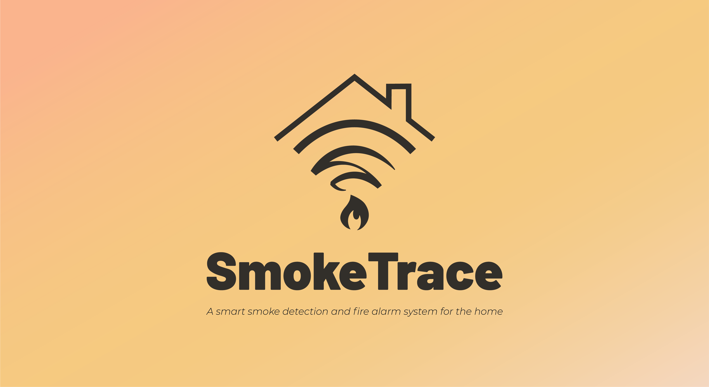
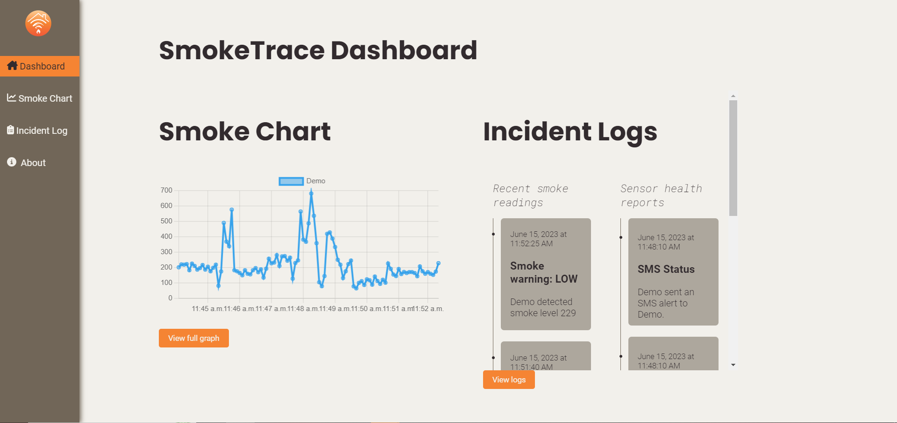

  
   
  <em> Powered by </em>
  

    
    
    
    
    
    
    
  

## ℹ About SmokeTrace
**SmokeTrace** is an [Internet of Things (IoT)](https://en.wikipedia.org/wiki/Internet_of_things) solution to protecting the home against fire accidents. The project was conceptualized in line with achieving the [UN Sustainable Development Goal 11](https://sdgs.un.org/goals/goal11): *Make cities and human settlements inclusive, safe, resilient and sustainable*.

The system comprises an MQ-2 Gas Sensor connected to an [ESP-32](http://esp32.net/) microcontroller that interacts seamlessly with the [SmokeTrace API](https://smoketrace-api.deno.dev/sensors) on the cloud. The system incorporates various actuation components, including a **persistent buzzer alarm** and **SMS alerts** sent to a user's phone number, which are triggered in response to a consistently high presence of smoke in the area. Furthermore, smoke readings and sensor status reports are collected in a database and presented through the [SmokeTrace web app](https://smoketrace.deno.dev)'s dashboard.

## 📈 The SmokeTrace Dashboard
The [SmokeTrace dashboard](https://smoketrace.deno.dev) provides an interface for users to view a graph of smoke readings *in real-time*, as they are collected by the sensors. In addition to this, significant events such as severe smoke readings, device disconnection and SMS alerts are collected in an incident log.

Below is a sample of the dashboard during the project's active period:

## 🔨Development
The SmokeTrace API and the web app are both hosted through [Deno Deploy](https://deno.com/deploy). The smoke reading, device status and phone number databases are hosted on Google's [Firebase](https://firebase.google.com/) platform. The web app is written in [TypeScript](https://www.typescriptlang.org/) with the [SvelteKit](https://kit.svelte.dev/) framework.
The SMS alert functionality is powered by the [Semaphore SMS API](https://semaphore.co/).

## 👥 Project Members
SmokeTrace was completed in June 2023 as a capstone project for the CS 145 (Computer Networks) course of the [Department of Computer Science](https://dcs.upd.edu.ph/), [University of the Philippines, Diliman](https://upd.edu.ph/), and presented at the annual [IoT Cup](https://dcs.upd.edu.ph/news/iot-cup-returns/) held by the department.

This project was a month-long collaborative endeavor undertaken by the dedicated SmokeTrace team:
- Ellis Caluag ([@Dox-Dev](https://github.com/Dox-Dev))
- Angelica Raborar ([@Anjellyrika](https://github.com/Anjellyrika))
- Hans Salazar ([@Hascion](https://github.com/Hascion))
- Erick Sarenas ([@Clawber](https://github.com/Clawber))
- Aaron Jude Tanael ([@eyronjuude](https://github.com/eyronjuude))
